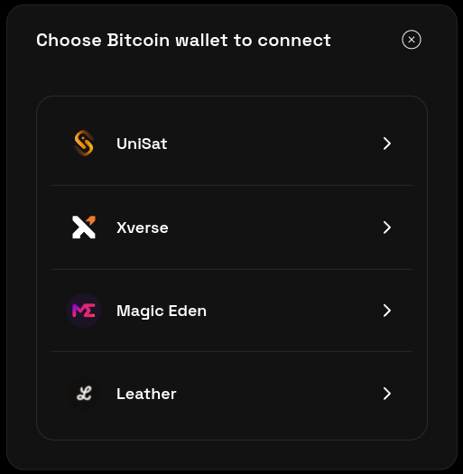

# sado-connect



## Introduction

**sado-connect** is a React component library that allows you to easily integrate Bitcoin Ordinals & Inscriptions via [Sado Protocol Connections](https://sado.space) with your decentralized application (dApp). We currently support [Unisat](https://unisat.io) and [Xverse](https://www.xverse.app). We stand as the pioneering walletkit to support ordinal-aware transactions, ensuring you never inadvertently spend a rare ordinal!

## Wallet Feature Support

| Wallet | Ordinal-safety | Inscription-safety |
| ------ | -------------- | ------------------ |
| Unisat | ✅             | ✅                 |
| Xverse | Coming soon    | ✅                 |

## Quick Start

Just two simple steps:

1.  Add dependency:

    ```bash
    pnpm install @sadoprotocol/sado-connect
    ```

2.  Import sado-connect into your dApp:

    ```javascript
    import { SadoConnectProvider, SadoConnectKit } from "@sadoprotocol/sado-connect";

    export default function YourReactComponent() {
      return (
        <SadoConnectProvider initialNetwork={"testnet"} initialSafeMode={true}>
          <SadoConnectKit />
        </SadoConnectProvider>
      );
    }
    ```

## Contribute

The following instructions will get you a copy of the project up and running on your local machine for development and testing purposes.

### Prerequisites

You'll need to have `pnpm` installed on your system. If it's not yet installed, you can get it via npm using:

```bash
npm install -g pnpm
```

### Development

To develop sado-connect, navigate to the sado-connect directory, install the necessary packages and serve the project:

```bash
cd packages/sado-connect
pnpm install
pnpm dev
```

The sample playground component is located at `packages/sado-connect/src/main.tsx`.

Changes made to the code will be reflected immediately.

## Local Integration Testing

For inter-repo local testing:

1. Link the global package to the local project:

   ```bash
   pnpm link packages/sado-connect --global
   ```

2. `cd` to any repo of your choosing (e.g., ordzaar).

3. The remaining steps are identical to [Quick Start](#quick-start).

Happy coding! For any issues or feature requests, please raise an issue in the GitHub repository.
